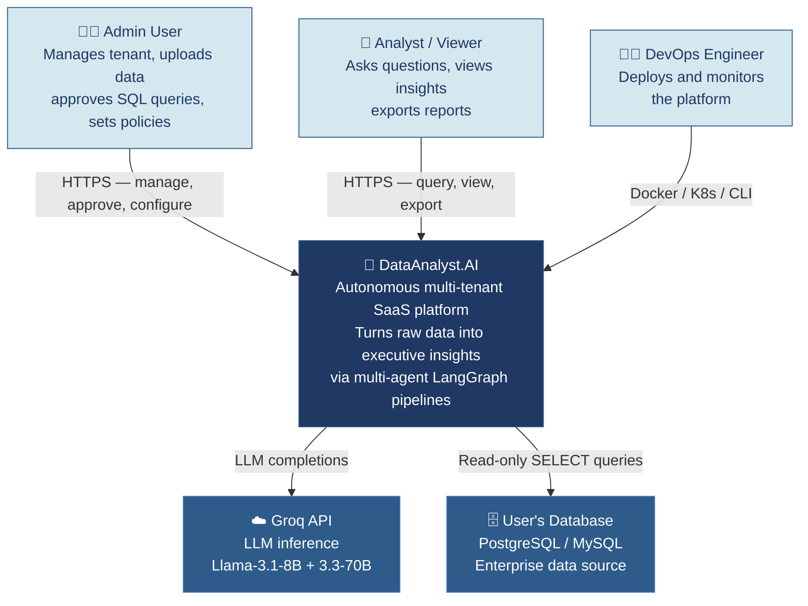
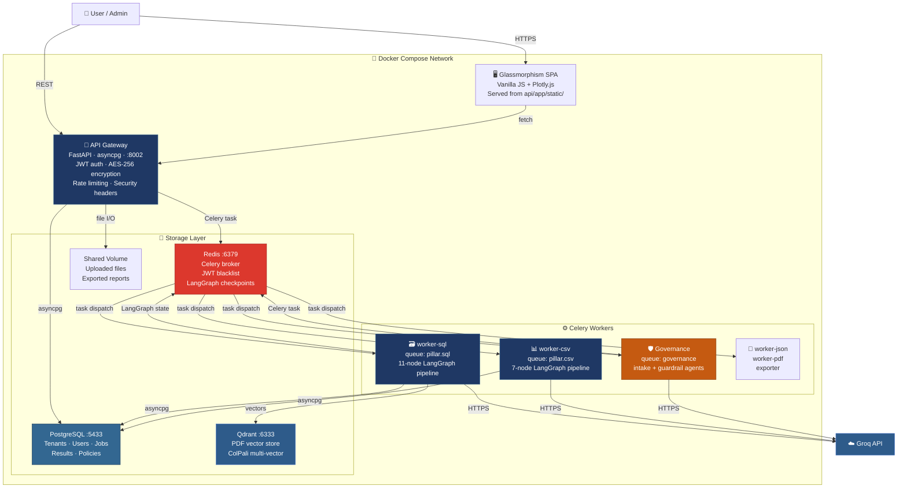
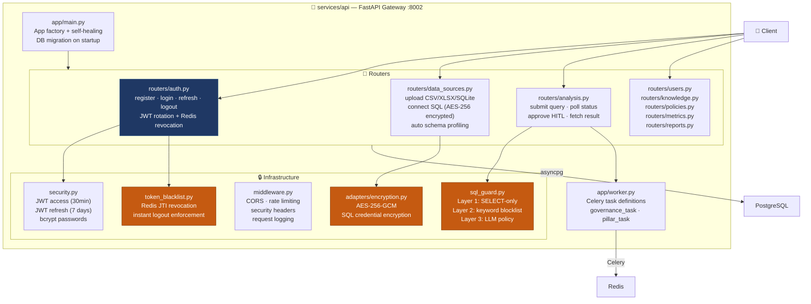
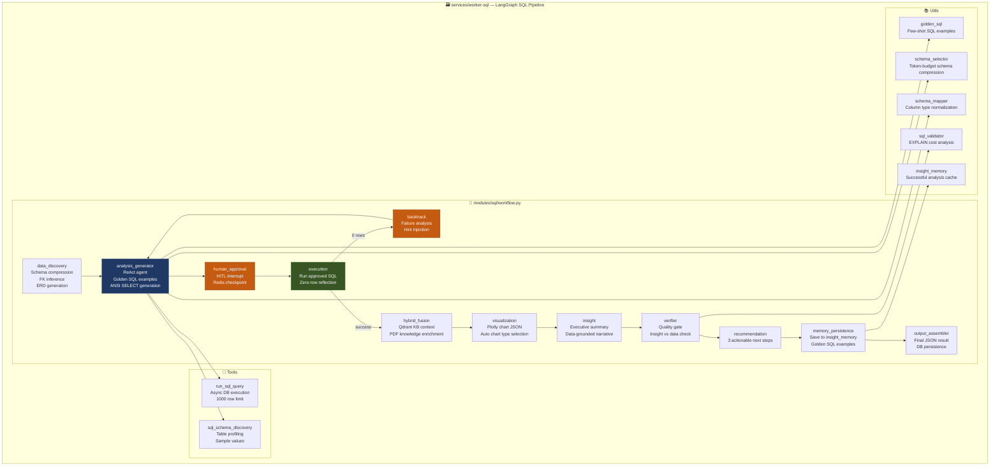
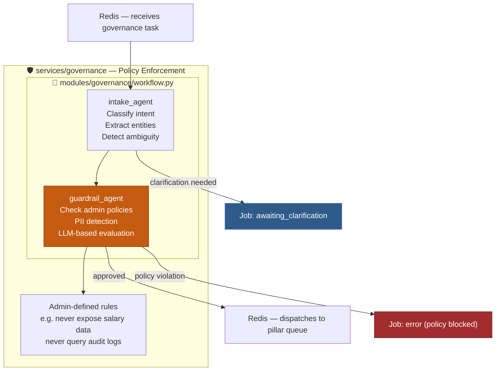
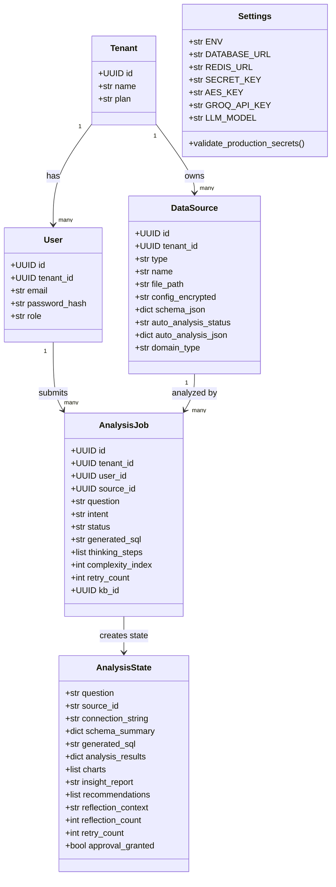
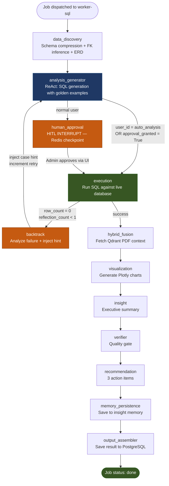
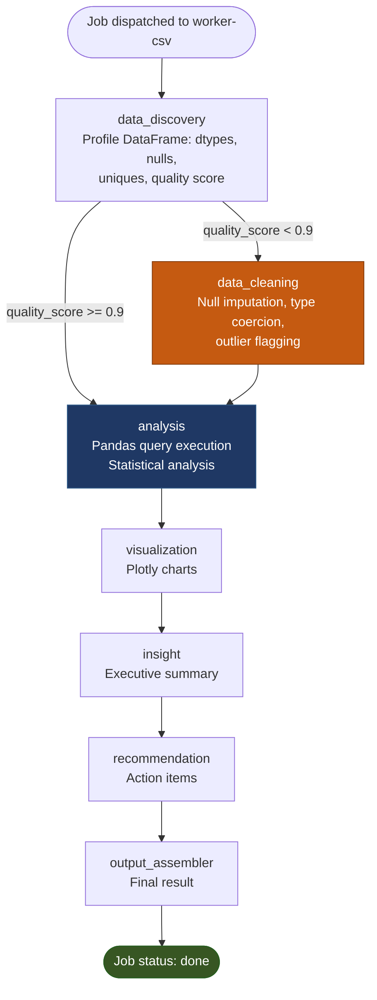
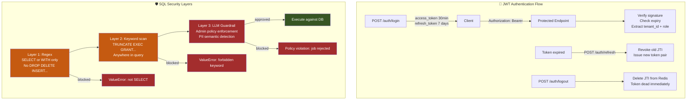

# C4 Architecture Diagrams

**DataAnalyst.AI — Autonomous Enterprise Data Analyst**

---

## Level 1 — System Context

Who uses the system and what external systems does it interact with?

---

## Level 2 — Container Diagram

What are the deployable units and how do they communicate?

---

## Level 3 — Component Diagram: API Gateway

---

## Level 3 — Component Diagram: SQL Worker

---

## Level 3 — Component Diagram: Governance Worker

---

## Level 4 — Code: Key Classes

---

## LangGraph SQL Pipeline Flow

---

## CSV Pipeline Flow

---

## Security Architecture

