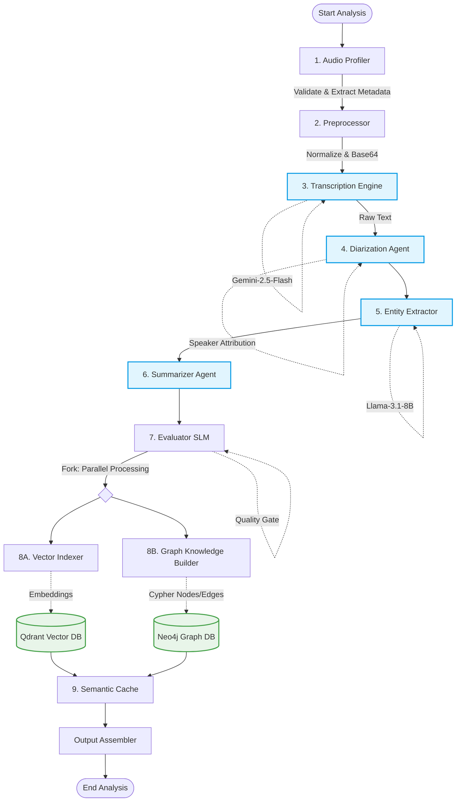

<div align="center">

# 🎙️ Worker Audio — The Enterprise Audio Intelligence Pillar

**Advanced GraphRAG Audio Processing, Speaker Diarization & Semantic Network Extraction**

[](https://python.org)
[](https://docs.celeryq.dev)
[](https://neo4j.com)
[](https://langchain-ai.github.io/langgraph/)

</div>

---

## 🎯 Architectural Overview

The `worker-audio` service is a critical intelligence pillar within the OpenQ platform. Unlike traditional systems that treat audio processing as a linear Speech-to-Text translation, this service is engineered as a **Cognitive Knowledge Graph Extractor**. 

It ingests unstructured audio (meetings, earnings calls, interviews) and transforms them into a queryable, multidimensional data structure. By leveraging a **9-node Directed Acyclic Graph (DAG)** built on LangGraph, the system guarantees high-fidelity transcription, precise speaker attribution (Diarization), and semantic enrichment.

---

## 🏗️ The 9-Node LangGraph Pipeline

The core engine is defined in `app/modules/audio/workflow.py`. The execution flows through specialized AI agents, culminating in a parallel storage operation to maximize throughput.



---

## 🧠 Pipeline Stages (Deep Dive)

### 🛡️ Stage 1: Validation & Preprocessing
*   **Audio Profiler (`audio_profiler.py`):** Inspects the raw audio file (bitrate, channels, format) to ensure it meets the system's processing constraints. Invalid files are aborted early to save compute costs.
*   **Preprocessor (`preprocessor_agent.py`):** Normalizes the acoustic signal and encodes the payload into Base64 for safe multimodal LLM transport.

### 🗣️ Stage 2: Acoustic Intelligence
*   **Transcription (`transcription_agent.py`):** Utilizes `gemini-2.5-flash-preview`'s native multimodal acoustic understanding to generate high-accuracy transcripts directly from the audio bytes.
*   **Diarization (`diarization_agent.py`):** Solves the "Who said what?" problem. It maps generic `SPEAKER_XX` tags to actual names by analyzing conversational context and introductions within the text.

### 🌐 Stage 3: Semantic Enrichment
*   **Entity Extraction (`entity_extractor.py`):** Powered by `llama-3.1-8b`, this agent scans the diarized transcript to extract critical entities (Companies, Technologies, People, Decisions, Action Items).
*   **Summarization (`summarizer_agent.py`):** Generates hierarchical summaries (Global meeting summary vs. individual topic summaries) using `gemini-flash-lite`.

### ⚖️ Stage 4: Quality Assurance
*   **Evaluator (`evaluation_agent.py`):** A zero-cost, local Small Language Model (SLM) acts as a quality gate. It compares the extracted entities against the transcript to calculate an *Attribution Score*, ensuring zero hallucination.

### 🗄️ Stage 5: Parallel Storage (Vector + Graph)
To eliminate bottlenecks, storage happens concurrently:
*   **Vector Indexer (`vector_indexer.py`):** Chunks the transcript and embeds it into **Qdrant**. This enables sub-second semantic similarity searches ("Find the part where they discussed the budget").
*   **Graph Builder (`graph_knowledge_builder.py`):** Executes complex Cypher transactions to build the topology in **Neo4j**.

---

## 🕸️ Neo4j Graph Schema

The service maps the audio into the following ontological structure in Neo4j:

*   `(AudioFile {id, duration, summary})`
*   `(Speaker {name})`
*   `(Turn {text, start_time, end_time})`
*   `(Entity {name, type})`

**Relationships Formed:**
*   `(Speaker) -[:SPOKE]-> (Turn)`
*   `(Turn) -[:BELONGS_TO]-> (AudioFile)`
*   `(Turn) -[:MENTIONS]-> (Entity)`
*   `(Turn) -[:FOLLOWS]-> (Turn) ` *(Maintains conversational sequence)*

This schema allows the Universal Strategic Nexus to answer complex queries like: *"Did Speaker A agree with Speaker B regarding Entity X?"*

---

## ⚡ Fast Retrieval & Semantic Caching

To respect compute costs and ensure sub-second response times for subsequent queries:
1.  **Skip-Indexing:** If an Audio file ID is already detected in the Neo4j graph, the heavy indexing pipeline is bypassed.
2.  **Semantic Cache (`semantic_cache_agent.py`):** Retrieves pre-calculated answers from Qdrant/Redis if a functionally identical question was asked recently.

---

## ⚙️ Environment Variables

The worker relies on the following configurations (typically injected via Kubernetes Secrets/ConfigMaps):

| Variable | Description | Example |
|---|---|---|
| `LLM_MODEL_AUDIO` | Multimodal model for transcription. | `google/gemini-2.5-flash-preview` |
| `LLM_MODEL_EXTRACTION` | LLM for entity extraction. | `meta-llama/llama-3.1-8b-instruct` |
| `NEO4J_URI` | Neo4j Bolt connection string. | `bolt://neo4j:7687` |
| `NEO4J_USERNAME` | Neo4j authentication username. | `neo4j` |
| `NEO4J_PASSWORD` | Neo4j authentication password. | `********` |
| `QDRANT_URL` | Qdrant vector DB endpoint. | `http://qdrant:6333` |
| `REDIS_URL` | Celery broker and result backend. | `redis://redis:6379/0` |
| `DATABASE_URL` | Postgres URL for metadata storage. | `postgresql+asyncpg://...` |

---

## 💻 Local Development & Testing

### 1. Running the Celery Worker
Ensure Redis, Neo4j, and Qdrant are running (via Docker Compose or K8s Port-Forwarding), then start the worker:
```bash
celery -A app.worker:celery_app worker -Q pillar.audio --loglevel=info --concurrency=2
```

### 2. Triggering a Test Task
You can simulate a Universal Nexus request by pushing a task to the queue:
```python
from celery import Celery

app = Celery('openq', broker='redis://localhost:6379/0')
app.send_task(
    'app.worker.run_audio_analysis',
    kwargs={
        "tenant_id": "tenant_123",
        "file_id": "meeting_recording_01",
        "question": "Summarize the key action items assigned to the engineering team."
    },
    queue='pillar.audio'
)
```

---
*Built with 🖤 by the OpenQ Architecture Team.*
